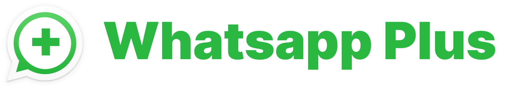
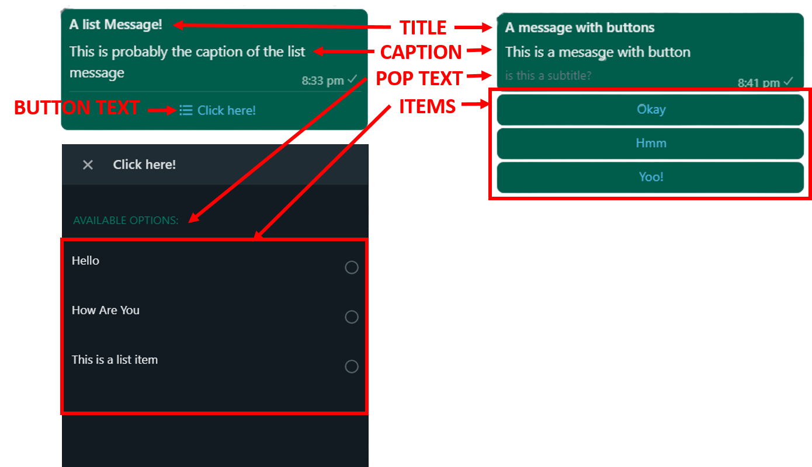

<p align="center">


</p>
<p align="center">Whatsapp + Will give you two awesome features for your normal whatsapp! Give your whatsapp superpowers! Made with <a href="https://github.com/pedroslopez/whatsapp-web.js/">whatsapp-web.js</a></p>

> ⚠️ **DISCLAIMER**:
>
> -   This is made for non-business account
> -   I am not responsible for anything you do with this! Use at your own risk
> -   The button message is a brittle feature since it is based on a pull request!

<br>
<p align="center"> 
</p>
<br>
<hr>

# What can you do?

1. [**LIST MESSAGES**](#making-a-list-message) : You can send list messages with title, caption and of course items int the list! You can also customize the button to open the list
2. [**BUTTON MESSAGE**](#making-a-button-message) : You can send messages with buttons (max 3). You can also give title, caption and a subtitle!
   <br>

# Get Started

1. Clone this repository or download the latest [Release](#)
2. Go to root directory
3. Install dependencies

```js
npm install
```

4. Start the script `index.js`

```js
node index.js
```

4. Now wait for a sec and Scan the QR code with your WhatsApp Mobile App

5. BOOM! You got the pro version!!

# Usage

Before You get started, refer this image to identify various elements of the message



## Making a list message

List message contain the following elements :

-   Title : Title of the message `--title`
-   Caption : Caption of the message `--cap`
-   Button Text : Text of the button to open the list `--button`
-   Pop Text: The text in the pop-up of list items `--pop`
-   Items : Various list items

You can create a button with the `!list` command. If you skip any option, it will be set tu a default value! And if no items are provided, the message wont be created. If you want to add space to the item, use underscore `_`

##### Template

```
!list <option>="<text>" item1 item2 item3
```

##### Example

```
!list --title="A list Message!" --cap="This is probably the caption of the list message" Hello How_Are_You This_is_a_list_item
```

##### Output

<p align="center"> 
</p>

## Making a Button message

Button message contain the following elements :

-   Title : Title of the message `--title`
-   Caption : Caption of the message `--cap`
-   Items : Various buttons
-   Pop Text: Here, it is the little subtitle below caption `--pop`

You can create a button with the `!btn` command. If you skip any option, it will be set tu a default value! And if no items are provided, the message wont be created. If you want to add space to the item, use underscore `_`

> **NOTE**:
>
> -   The button message is a brittle feature since it is based on a pull request!
> -   You can only add up to 3 buttons, more buttons will be ignored

##### Template

```
!btn <option>="<text>" button1 button2 button3
```

##### Example

```
!btn --title="A message with buttons" --cap="A message with buttons" --pop="is this a subtitle?" Okay Hmm Yoo!
```

##### Output

<p align="center"> </p>

## Changing command Prefix

The default command prefix is `!` eg. `!btn`. If you want to change it, you can create an Environment Variable `PREFIX` and give your desired prefix

eg. If you want `#` to be your prefix

```.env
PREFIX=#
```

# 💪 Support

Support this project by buying me a coffee and starring ⭐ this repo!

<a href="https://www.buymeacoffee.com/harrytom" target="_blank"></a><br>
